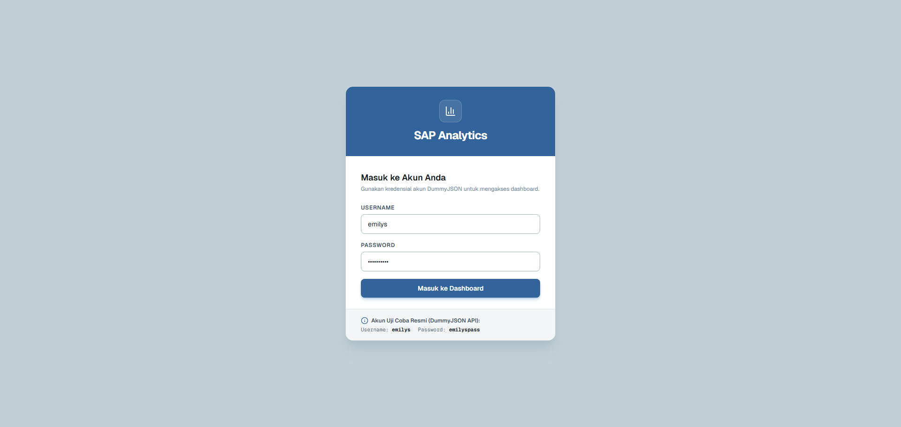
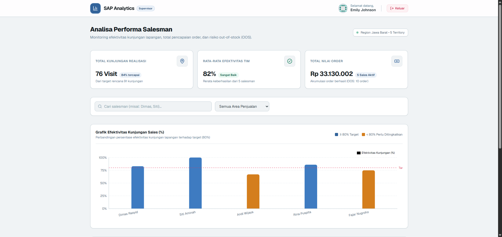

# Web Dashboard SAP (Sales Automation Platform)

Aplikasi dashboard prototype untuk supervisor Sales Automation Platform (SAP) guna memantau dan menganalisa efektivitas kunjungan salesman lapangan, total pencapaian order, serta mendeteksi kendala pesanan gagal akibat kehabisan stok (_out-of-stock_ / OOS).

> 🌐 **Live Demo Website:** [https://sap-testcase-demo.vercel.app/](https://sap-testcase-demo.vercel.app/)

---

## Preview Antarmuka

| Halaman Login | Halaman Dashboard |
| :---: | :---: |
|  |  |

---

## Panduan Instalasi & Menjalankan Aplikasi

### 1. Prasyarat

- **Node.js**: Versi 18.18+ atau 20+
- **npm** (atau pnpm / yarn)

### 2. Instalasi Dependency

Buka terminal di direktori proyek, lalu jalankan:

```bash
npm install
```

### 3. Menjalankan Server Development

Jalankan perintah berikut:

```bash
npm run dev
```

Setelah server menyala, buka peramban (_browser_) dan akses:
**[http://localhost:3000](http://localhost:3000)**

Rute `/` akan otomatis mengarahkan ke `/dashboard`, dan karena belum login, Anda akan diarahkan ke `/login`.

---

## Kredensial Akun Pengujian (Live API DummyJSON)

Autentikasi terhubung langsung ke REST API publik DummyJSON (`POST https://dummyjson.com/auth/login`). Gunakan akun pengujian berikut:

| Keterangan   | Nilai        |
| :----------- | :----------- |
| **Username** | `emilys`     |
| **Password** | `emilyspass` |

> 💡 _Catatan:_ Form login juga mendukung pengujian kredensial yang salah (misal: username atau password diisi sembarang) untuk melihat pesan penanganan error.

---

## Fitur Utama Aplikasi

1. **Autentikasi Live API & Route Guarding**:
   - Terintegrasi langsung dengan API publik DummyJSON (`POST /auth/login`).
   - Penanganan validasi form, loading feedback, serta pesan error interaktif (400/401).
   - Proteksi rute otomatis: Pengguna yang belum terautentikasi otomatis dialihkan ke `/login`, dan pengguna yang sudah login dialihkan ke `/dashboard`.
   - Menampilkan profil pengguna (nama lengkap dan avatar) pada header serta tombol logout yang membersihkan sesi.

2. **Ringkasan Metrik Kinerja (Summary KPI Cards)**:
   - **Total Kunjungan Realisasi**: Akumulasi kunjungan aktual tim beserta persentase ketercapaian dari target rencana (`kunjungan_planned`).
   - **Rata-rata Efektivitas Tim**: Rerata persentase efektivitas seluruh salesman dengan status indikator (_Sangat Baik_ vs _Perlu Perhatian_).
   - **Total Nilai Order (Rp)**: Akumulasi nilai pesanan yang berhasil dicatat dalam format mata uang Rupiah Indonesia (`IDR`), dilengkapi jumlah kasus _Out-of-Stock_ (OOS).

3. **Visualisasi Grafik Interaktif (Sales Chart)**:
   - Diagram batang (_Bar Chart_) menggunakan Recharts untuk membandingkan efektivitas kunjungan antar salesman.
   - Garis benchmark target efektivitas 80% (_Reference Line_).
   - Pewarnaan batang kondisional (Indigo untuk $\ge 80\%$, Amber untuk $< 80\%$) dan tooltip interaktif yang menampilkan detail data saat kursor diarahkan ke grafik.
   - Dilengkapi _SSR mount guard_ untuk menjamin rendering bebas kendala di Next.js.

4. **Filter Wilayah & Pencarian Real-Time**:
   - Pencarian salesman berdasarkan nama secara _case-insensitive_.
   - Dropdown filter area yang diekstrak secara dinamis dari dataset unik.
   - Tombol _Reset Filter_ yang muncul otomatis saat filter atau pencarian sedang aktif.
   - Tampilan _empty state_ yang informatif jika hasil pencarian tidak ditemukan.

5. **Tabel Rincian dengan Pengurutan Kolom Interaktif (Sorting)**:
   - Tabel performa komprehensif menampilkan seluruh metrik data sales.
   - **Multi-Column Sorting**: Pengurutan kolom (Nama Sales, Area, Realisasi Kunjungan, Efektivitas %, Total Order Rp, dan Order OOS) dengan indikator panah dinamis dan tombol reset urutan.
   - Progress bar visual untuk persentase efektivitas kunjungan dan badge indikator risiko pesanan gagal (OOS).

---

## Alasan Pemilihan Pendekatan Teknis (Technical Justification)

Berdasarkan rubrik penilaian kriteria teknis, berikut adalah alasan di balik arsitektur dan pustaka yang digunakan:

| Teknologi / Pendekatan                | Alasan Pemilihan & Manfaat Teknis                                                                                                                                                                                                                             |
| :------------------------------------ | :------------------------------------------------------------------------------------------------------------------------------------------------------------------------------------------------------------------------------------------------------------ |
| **Next.js (App Router)**              | Menyediakan arsitektur berbasis komponen modern dengan pemisahan Client/Server Component yang efisien, manajemen layout terpusat (`layout.tsx`), serta optimasi aset bawaan Next.js.                                                                          |
| **TypeScript (Strict Mode)**          | Menjamin integritas data dari API dan dataset mock dengan antarmuka bertipe ketat (`SalesItem`, `AuthUser`, `LoginResponse`). Mencegah _runtime error_, memudahkan _refactoring_, dan meningkatkan keterbacaan kode tim.                                      |
| **Tailwind CSS**                      | Menghasilkan kode CSS yang ramping, konsisten, dan sangat cepat dikembangkan dengan sistem _design tokens_. Memudahkan pembuatan tata letak responsif (_mobile-first_) untuk kebutuhan supervisor di perangkat desktop maupun tablet.                         |
| **React Context API (`AuthContext`)** | Dipilih untuk manajemen state autentikasi global karena sifatnya yang _lightweight_, tanpa memerlukan dependensi eksternal berlebih (seperti Redux Toolkit atau Zustand) yang dapat menambah ukuran bundle aplikasi (_overkill_) untuk skala proyek saat ini. |
| **Recharts**                          | Library visualisasi data deklaratif yang dibangun khusus di atas React SVG. Responsif terhadap ukuran kontainer (`ResponsiveContainer`), mudah dikustomisasi temanya, dan memiliki performa rendering yang sangat mulus.                                      |
| **React Hook Form + Zod**             | Menangani form login dengan pendekatan deklaratif berbasis skema (_schema-driven validation_). Menghasilkan validasi input yang _type-safe_, pesan error yang jelas, dan performa tinggi tanpa _unnecessary re-renders_.                                      |
| **Lucide React**                      | Menyediakan ikon vektor yang konsisten, berbobot ringan, dan _tree-shakeable_ otomatis, menggantikan SVG mentah demi meningkatkan keterbacaan serta kebersihan kode (_clean code_).                                                                           |

---

## Asumsi Teknis & Bisnis yang Diambil

Sesuai dengan arahan pada dokumen soal (halaman 2 & 5) mengenai penulisan asumsi secara eksplisit:

1. **Ambang Batas Target Efektivitas ($80\%$)**:
   - Target efektivitas kunjungan ditetapkan sebesar $80\%$ sebagai standar acuan performa tim sales FMCG/distribusi modern. Salesman dengan efektivitas $\ge 80\%$ dikategorikan memenuhi target, sedangkan $< 80\%$ ditandai memerlukan pembinaan/peningkatan.

2. **Struktur Data Dataset Mock**:
   - Pada tabel "Deskripsi Field Data" soal terdapat penyebutan field `kunjungan_unplanned`. Namun pada blok "Contoh Dataset (JSON)", field tersebut tidak disertakan pada objek data riil.
   - **Asumsi**: Aplikasi mengadopsi key yang tersedia pada JSON dataset contoh resmi (`nama_sales`, `area`, `kunjungan_planned`, `kunjungan_realisasi`, `efektivitas_visit_persen`, `total_order_rp`, `jumlah_order_oos`) untuk menjaga validasi tipe data TypeScript dan keakuratan kalkulasi.

3. **Manajemen Sesi Autentikasi**:
   - Sesuai klausul soal (_"Token/nama pengguna cukup disimpan di state aplikasi atau localStorage"_), kredensial dan token disimpan di `localStorage` peramban klien. Hal ini memungkinkan sesi login tetap bertahan ketika halaman di-_refresh_ tanpa membutuhkan server database session tambahan.

4. **Penanganan Kasus Out-of-Stock (OOS)**:
   - Jumlah pesanan gagal karena stok kosong dianggap sebagai metrik risiko operasional. Pada tabel, nilai 0 OOS ditampilkan sebagai kondisi positif (_Nol OOS_ dengan centang hijau), sementara nilai $> 0$ diberi penanda waspada berupa badge peringatan warna merah.

---

## Struktur Direktori Proyek

```plaintext
urbansolv-testcase/
├── app/
│   ├── dashboard/
│   │   └── page.tsx        # Halaman utama Dashboard (Protected Route)
│   ├── login/
│   │   └── page.tsx        # Halaman Login (Form & Integrasi API DummyJSON)
│   ├── globals.css         # Styling global Tailwind CSS & Geist Font
│   ├── layout.tsx          # Root Layout & AuthProvider Wrapper
│   └── page.tsx            # Redirection otomatis ke /dashboard
├── components/
│   ├── Header.tsx          # Navigasi atas, identitas pengguna, tombol logout
│   ├── SalesChart.tsx      # Visualisasi grafik efektivitas kunjungan (Recharts)
│   ├── SalesTable.tsx      # Tabel data sales interaktif dengan sorting multi-kolom
│   ├── SearchFilter.tsx    # Komponen pencarian sales & dropdown filter wilayah
│   └── SummaryCard.tsx     # Kartu ringkasan 3 metrik utama KPI
├── context/
│   └── AuthContext.tsx     # Context & Provider manajemen sesi autentikasi
├── data/
│   └── sales.json          # Dataset lokal mock performa salesman
├── lib/
│   ├── auth.ts             # Fungsi integrasi API login (Fetch DummyJSON)
│   └── utils.ts            # Helper modular (formatRupiah & cn)
├── schemas/
│   └── auth.ts             # Skema validasi Zod form autentikasi
└── types/
    └── index.ts            # Definisi interface TypeScript (SalesItem, AuthUser, dll.)
```
